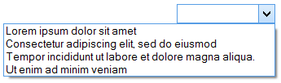

# ComboBox Dropdown Position and Width

In this example I've craeted a `ComboBox` which have 2 new useful features to let you set the position and size of drop-down:

- `DropDownAlignment`: You can set it to `Left`, then the drop-down will appear in it's normal position and it's left is aligned with left of control. If you set it to `Middle`, the middle of drop-down will be aligned with control and if you set it to `Right`, the right of drop-down will be aligned with right of control.

- `AutoWidthDropDown`: If you set it to `true` to, then `DropdownWidth` will be set to the width of the longest item. If you set it to `false` it uses `Width` as `DropDownWidth`.

Here is appearance of drop-down after setting `AutoWidthDropDown` to `true` and `DropDownAlignment` to `Left`, `Middle` and `Right`:

To do so, I've handled [`WM_CTLCOLORLISTBOX`](https://msdn.microsoft.com/en-us/library/windows/desktop/bb761360(v=vs.85).aspx) message, the `lparam` is the handle of drop-down and then you can set position of drop-down using [`SetWindowPos`](https://msdn.microsoft.com/en-us/library/windows/desktop/ms633545(v=vs.85).aspx).

Also you can calculate width of longest item and set as `DropDownWidth` if `AutoWidthDropDown` is true.